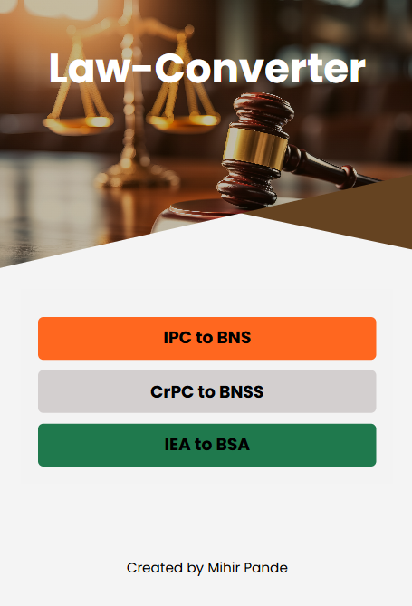
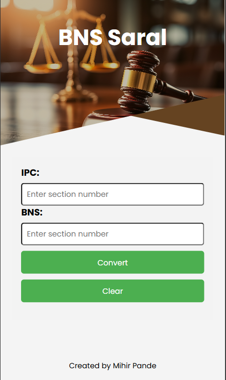

# 🏛 BNS Saral – Simplifying Legal Transitions  

**BNS Saral** is a Django-based web application designed to help users convert old IPC (Indian Penal Code) laws to their corresponding provisions in the new CrPC (Code of Criminal Procedure). This tool aims to provide an intuitive and efficient way for legal professionals, students, and researchers to adapt to the updated legal framework in India.  

---

## ✨ Features  

✅ **Seamless Law Conversion** – Instantly find new CrPC equivalents for old IPC sections.  
✅ **User-Friendly Interface** – Clean and intuitive design for easy navigation.  
✅ **Detailed Section Information** – Get additional insights for each law.  
✅ **Easy Deployment** – Includes a `Procfile` for hassle-free hosting.  
✅ **Optimized Codebase** – Uses Django best practices with separated requirements files.  

---

## 🏗 Tech Stack  

- **Backend:** Django
- **Frontend:** HTML, CSS, Bootstrap  
- **Database:** PostgreSQL  
- **Deployment:** Vercel  

---

## 🚀 Getting Started  

### Prerequisites  

Ensure you have the following installed:  

- Python 3.x  
- Git  

### Installation  

1️⃣ **Clone the repository:**  
```bash
git clone https://github.com/meeheer123/BNS-Saral.git
cd BNS-Saral
```
  
2️⃣ **Activate the virtual environment:**  
```bash
python3 -m venv venv
source venv/bin/activate  # On Windows: venv\Scripts\activate
```

3️⃣ **Install dependencies:**  
```bash
pip install -r requirements.txt
```

4️⃣ **Apply migrations:**  
```bash
cd src
python manage.py migrate
```

5️⃣ **Run the development server:**  
```bash
python manage.py runserver
```

🔗 Now, open `http://127.0.0.1:8000` in your browser.  

---

## 📷 Screenshots 





---

## 🎯 Future Enhancements  

🔹 AI-based legal text analysis  
🔹 Search functionality for quick lookups  
🔹 Support for regional languages  
🔹 API integrations for external legal tools  

---

## 🤝 Contributing  

Contributions are welcome! Please fork the repository and submit a pull request with your improvements.  

---

## 📜 License  

This project is licensed under the **MIT License**. See the `LICENSE` file for details.  

---